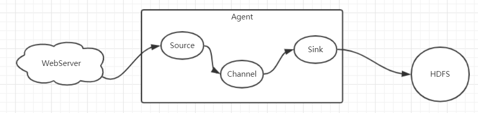
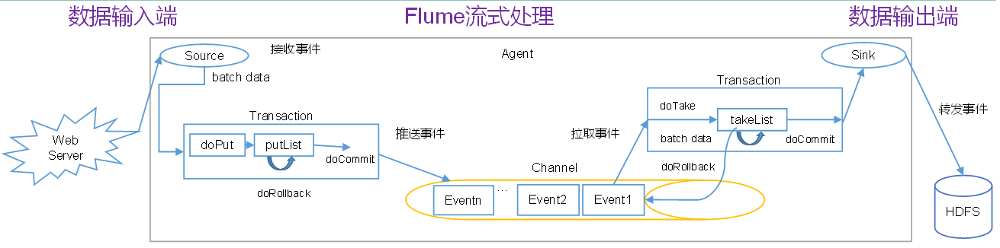

# Flume

Cloudera公司提供的分布式，高可靠，海量日志采集，聚合传输系统，主要的作用就是实时读取服务器磁盘的数据，将数据写入HDFS。

Flume的组成：

1）Agent是一个JVM进程，他以事件的形式，将数据从源头送到目的地，由上面的三个部分组成

2）Source是负责将数据接收到Flume的Agent的组件，支持多种数据格式：`avro、thrift、`、jms、**`exec , spooling directory`**、netcat、sequence generator、syslog、http、legacy`

3）Channel是位于Source和Sink之间的缓冲区。因此，Channel允许Source和Sink运作在不同的速率上。Channel是线程安全的，可以同时处理几个Source的写入操作和几个Sink的读取操作。Flume自带两种Channel：Memory Channel和File Channel。

* Memory Channel是内存中的队列。Memory Channel在不需要关心数据丢失的情景下适用。如果需要关心数据丢失，那么Memory Channel就不应该使用，因为程序死亡、机器宕机或者重启都会导致数据丢失。

* File Channel，将所有事件写到磁盘，因此在程序关闭或机器宕机的情况下不会丢失数据。

4）Sink不断地轮询Channel中的事件且批量地移除它们，并将这些事件批量写入到存储或索引系统、或者被发送到另一个Flume Agent。Sink是完全事务性的。在从Channel批量删除数据之前，每个Sink用Channel启动一个事务。批量事件一旦成功写出到存储系统或下一个Flume Agent，Sink就利用Channel提交事务。事务一旦被提交，该Channel从自己的内部缓冲区删除事件。Sink组件目的地包括hdfs、logger、avro、thrift、ipc、file、null、HBase、solr、自定义。

传输单元，Flume数据传输的基本单元，以事件的形式将数据从源头送至目的地。  Event由可选的header和载有数据的一个byte array 构成。Header是容纳了key-value字符串对的HashMap。

