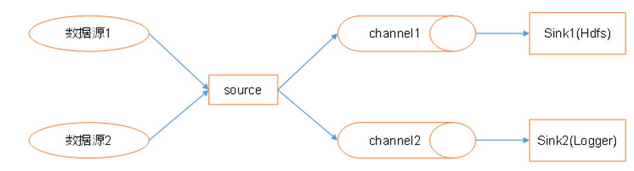

# Flume

## 是什么

Cloudera公司提供的分布式，高可靠，海量日志采集，聚合传输系统，主要的作用就是实时读取服务器磁盘的数据，将数据写入HDFS。

## Flume的架构

Flume的组成：

1）Agent是一个JVM进程，他以事件的形式，将数据从源头送到目的地，由上面的三个部分组成

2）Source是负责将数据接收到Flume的Agent的组件，支持多种数据格式：`avro、thrift、`、jms、**`exec , spooling directory`**、netcat、sequence generator、syslog、http、legacy`

3）Channel是位于Source和Sink之间的缓冲区。因此，Channel允许Source和Sink运作在不同的速率上。Channel是线程安全的，可以同时处理几个Source的写入操作和几个Sink的读取操作。Flume自带两种Channel：Memory Channel和File Channel。

* Memory Channel是内存中的队列。Memory Channel在不需要关心数据丢失的情景下适用。如果需要关心数据丢失，那么Memory Channel就不应该使用，因为程序死亡、机器宕机或者重启都会导致数据丢失。

* File Channel，将所有事件写到磁盘，因此在程序关闭或机器宕机的情况下不会丢失数据。

4）Sink不断地轮询Channel中的事件且批量地移除它们，并将这些事件批量写入到存储或索引系统、或者被发送到另一个Flume Agent。Sink是完全事务性的。在从Channel批量删除数据之前，每个Sink用Channel启动一个事务。批量事件一旦成功写出到存储系统或下一个Flume Agent，Sink就利用Channel提交事务。事务一旦被提交，该Channel从自己的内部缓冲区删除事件。Sink组件目的地包括hdfs、logger、avro、thrift、ipc、file、null、HBase、solr、自定义。

传输单元，Flume数据传输的基本单元，以事件的形式将数据从源头送至目的地。  Event由可选的header和载有数据的一个byte array 构成。Header是容纳了key-value字符串对的HashMap。

## 怎么玩？

如何启动flume：

~~~shell
bin/flume-ng agent -c conf/ -n a1 –f job/flume-netcat-logger.conf -Dflume.root.logger=INFO,console

# 对应的各个参数的信息：
--conf conf/   #：表示配置文件存储在conf/目录
--name a1	   # ：表示给agent起名为a1
--conf-file  job/flume-netcat.conf   # ：flume本次启动读取的配置文件是在job文件夹下的flume-telnet.conf文件。
-Dflume.root.logger==INFO,console  # ：-D表示flume运行时动态修改flume.root.logger参数属性值，并将控制台日志打印级别设置为INFO级别。日志级别包括:log、info、warn、error。
~~~

### Channel选择器：

Flume中channel的数据是完整的数据，如果一个channel对应了多个sink，那么每个sink只是channel中的部分数据，但是分流的时候往往不这么做，通常的做法是会使用一个拦截器，将event拦截下来，然后打上特定的标签，然后再使用channel选择器将分往不同的channel，在进入channel之前就完成数据的分流，而不是使用sink。

Channel selector 可以让不同的项目日志通过不同的Channel到不同的sink中去，有两种Channel选择器：

* Replicating Channel Selector ：会将source过来的events发往所有的Channel
* Multiplexing Channel Selector ：可以选择应该发往哪些Channel

