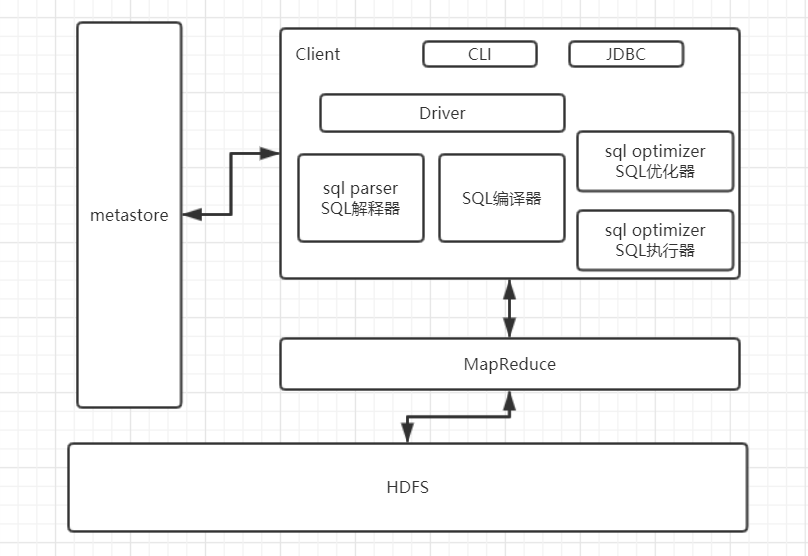
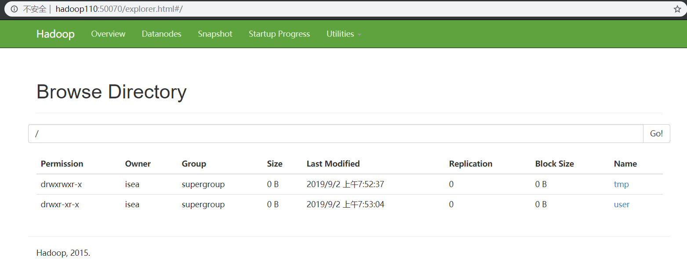
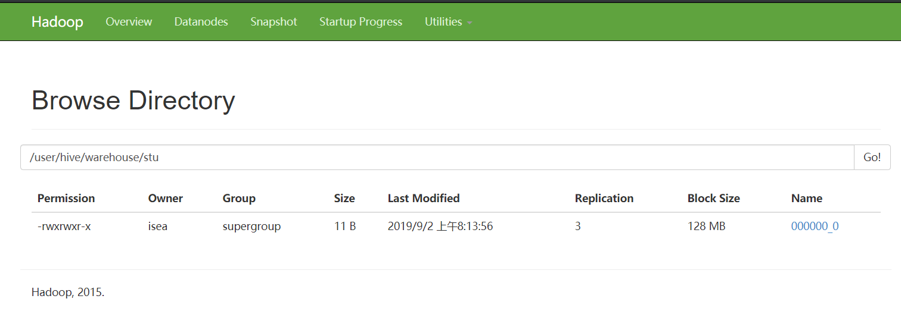

# Hive 

## 是什么？

* HIve是Facebook开源，一款数据仓库工具，可以将结构化的数据文件映射成一张表，提供类SQL功能。

* 本质是MapReduce在执行计算，数据存储在HDFS上
* 程序运行在Yarn上
* 适用于大数据情景下的高延迟数据分析

## hive的架构

* metastrore是存储元数据的数据库，默认使用的是derby，可以更改为***MySQL***，元数据指的是将结构化数据映射成一张表的**表名，表所属的数据库（默认为default），表的拥有者，表的列，分区字段，表的类型（是否为外部表），表所在的目录**等

用户通过hive的客户端向hive发送SQL语句，hive收到SQL语句之后，会结合SQL语句和元数据信息生成MapReduce程序，最后提交到Yarn上执行，并将MapReduce执行的结果返回给客户端。

## Hive和数据库：

Hive只是和数据库在SQL语句上有着类似之处，only。

* hive是为数据仓库而设计的，而数据库可以应用在online应用中，有着很低的延迟
* Hive的数据都是存储在HDFS上，而数据库的数据是存储在磁盘中的
* 数据是需要经常需要updata，和Insert的，而hive读多写少，hive中的数据基本都是在加载的时候确定好的
* hive是没有索引的，查询就是全表扫描，但是可以做到多台机器并并处理，而数据库可以建立索引，在数据量不大的情形下，索引能够很快的相应出数据

~~~shell
# 创建两个文件夹
[isea@hadoop110 hadoop-2.7.2]$ bin/hadoop fs -mkdir /tmp
[isea@hadoop110 hadoop-2.7.2]$ bin/hadoop fs -mkdir -p /user/hive/warehouse

# 查看HDFS上的文件路径
[isea@hadoop110 hadoop-2.7.2]$ bin/hadoop fs -ls /
Found 2 items
drwxr-xr-x   - isea supergroup          0 2019-09-02 07:52 /tmp
drwxr-xr-x   - isea supergroup          0 2019-09-02 07:53 /user

# 在HDFS上创建/tmp和/user/hive/warehouse两个目录并修改他们的同组权限可写
[isea@hadoop110 hadoop-2.7.2]$ bin/hadoop fs -chmod g+w /tmp/
[isea@hadoop110 hadoop-2.7.2]$ bin/hadoop fs -chmod g+w /user/hive/warehouse  # 这里修改的是warehouse这个目录的权限
~~~

Hive中默认就只有一个库：***default*** ，该库下面没有任何的表。

## Hive的shell操作

~~~shell
# 启动hive：
[isea@hadoop110 apache-hive-1.2.1-bin]$ bin/hive

# 查看hdfs文件系统
hive> dfs -ls /;
Found 2 items
drwxrwxr-x   - isea supergroup          0 2019-09-02 08:13 /tmp
drwxr-xr-x   - isea supergroup          0 2019-09-02 07:53 /user

# 在hive窗口中查看本地文件系统
hive> ! ls /opt/module;
apache-hive-1.2.1-bin
datasource
hadoop-2.7.2
jdk1.8.0_144
kafka_2.11-0.11.0.2
zookeeper-3.4.10

# 查看hive中输入的历史命令，需要先进入但前用户的家目录
cat .hivehistory

# -e -f的作用
./bin/hive -e
./bin/hive -f

# 创建一张stu表，并尝试插入数据：
hive> create table stu(id int,name string);
OK
Time taken: 0.971 seconds
hive> show tables;
OK
stu
Time taken: 0.019 seconds, Fetched: 1 row(s)

# 插入数据的时候执行MR程序
hive> insert into stu values(1,"zhangfei");
Query ID = isea_20190902081329_62a50ed8-42e0-4444-9b31-b5fe0a67fbae
Total jobs = 3
Launching Job 1 out of 3
Number of reduce tasks is set to 0 since there's no reduce operator
Starting Job = job_1567381834182_0001, Tracking URL = http://hadoop111:8088/proxy/application_1567381834182_0001/
Kill Command = /opt/module/hadoop-2.7.2/bin/hadoop job  -kill job_1567381834182_0001
Hadoop job information for Stage-1: number of mappers: 1; number of reducers: 0
2019-09-02 08:13:46,043 Stage-1 map = 0%,  reduce = 0%
2019-09-02 08:13:57,524 Stage-1 map = 100%,  reduce = 0%, Cumulative CPU 3.43 sec
MapReduce Total cumulative CPU time: 3 seconds 430 msec
Ended Job = job_1567381834182_0001
Stage-4 is selected by condition resolver.
Stage-3 is filtered out by condition resolver.
Stage-5 is filtered out by condition resolver.
Moving data to: hdfs://hadoop110:9000/user/hive/warehouse/stu/.hive-staging_hive_2019-09-02_08-13-29_878_3657628842568788435-1/-ext-10000
Loading data to table default.stu
Table default.stu stats: [numFiles=1, numRows=1, totalSize=11, rawDataSize=10]
MapReduce Jobs Launched: 
Stage-Stage-1: Map: 1   Cumulative CPU: 3.43 sec   HDFS Read: 3540 HDFS Write: 78 SUCCESS
Total MapReduce CPU Time Spent: 3 seconds 430 msec
OK
Time taken: 30.265 seconds

# 删除该表，删除之后，在HDFS上就没有该表的数据了
hive> drop table stu;
OK
Time taken: 0.987 seconds

~~~

该表在HDFS上面的存在形式和路径：

### 将本地文件加载到Hive的案例

将本地的`/opt/module/datas/studnet.txt`这个目录下的数据导入到hive的`student(id int,name string)`表中

~~~shell
#
[isea@hadoop110 hive]$ pwd
/opt/module/datasource/hive

[isea@hadoop110 hive]$ vim student.txt  # 这里以tab键作为分隔符号
1001	z3
1002	l4
1003	w5

# 创建student表，并且声明文件分隔符号'\t'
hive> create table student(id int ,name string) row format delimited fields terminated by '\t';

# 加载数据到student的数据表
hive> load data local inpath '/opt/module/datasource/hive/student.txt' into table student;
Loading data to table default.student
Table default.student stats: [numFiles=1, totalSize=24]
OK
Time taken: 0.355 seconds

# 可以发现这样加载数据的方式比起直接插入要快很多，因为不需要走MR。

~~~

### 配置问题

* Default数据仓库的最原始的位置是在HDFS上的：/user/hive/warehouse路径下
* 在仓库的目录下，没有默认的数据库default创建文件夹，如果某张表属于default数据库，直接在数据仓库下创建一个文件夹
* 修改default数据仓库的位置：

~~~xml
<property>
<name>hive.metastore.warehouse.dir</name>
<value>/user/hive/warehouse</value>
<description>location of default database for the warehouse</description>
</property>
~~~

* Hive的配置有三种方式，`hive-default.xml,hive-site.xml,command line（进队本次启动有效）`用户自定义配置会覆盖默认配置。另外，Hive也会读入Hadoop的配置，因为Hive是作为Hadoop的客户端启动的，Hive的配置会覆盖Hadoop的配置。配置文件的设定对本机启动的所有Hive进程都有效。

## 系统函数

### collect_set函数

~~~SQL
--1）创建原数据表
drop table if exists stud;
create table stud (name string, area string, course string, score int);
--2）向原数据表中插入数据

insert into table stud values('zhang3','bj','math',88);
insert into table stud values('li4','bj','math',99);
insert into table stud values('wang5','sh','chinese',92);
insert into table stud values('zhao6','sh','chinese',54);
insert into table stud values('tian7','bj','chinese',91);

--3）查询表中数据
hive (gmall)> select * from stud;
stud.name       stud.area       stud.course     stud.score
zhang3 bj      math    88
li4     bj      math    99
wang5   sh      chinese 92
zhao6   sh      chinese 54
tian7   bj      chinese 91
--4）把同一分组的不同行的数据聚合成一个集合 
hive (gmall)> select course, collect_set(area), avg(score) from stud group by course;
chinese ["sh","bj"]     79.0
math    ["bj"]  93.5
--5） 用下标可以取某一个
hive (gmall)> select course, collect_set(area)[0], avg(score) from stud group by course;
chinese sh      79.0
math    bj      93.5
~~~

### 日期函数

#### date_format函数（根据格式整理日期）

~~~SQL
hive (gmall)> select date_format('2019-02-10','yyyy-MM');
2019-02
~~~

#### date_add函数（加减日期）

~~~SQL
select date_add('2019-02-10',-1);
2019-02-09

select date_add('2019-02-10',1);
2019-02-11
~~~

#### next_day函数  

~~~SQL
--（1）取当前天的下一个周一
hive (gmall)> select next_day('2019-02-12','MO')
2019-02-18
--说明：星期一到星期日的英文（Monday，Tuesday、Wednesday、Thursday、Friday、Saturday、Sunday）

--（2）取当前周的周一   
hive (gmall)> select date_add(next_day('2019-02-12','MO'),-7);
2019-02-11
hive (gmall)> select date_add(next_day('2019-06-09','mo'),-1);
2019-06-09
--计算本周周日，通常用下周一减一，避免直接使用next_day(‘sunday’,’su’),如果今天是周日，会产生错误
~~~

#### 4）last_day函数（求当月最后一天日期）

~~~SQL
hive (gmall)> select last_day('2019-02-10');
2019-02-28
~~~

