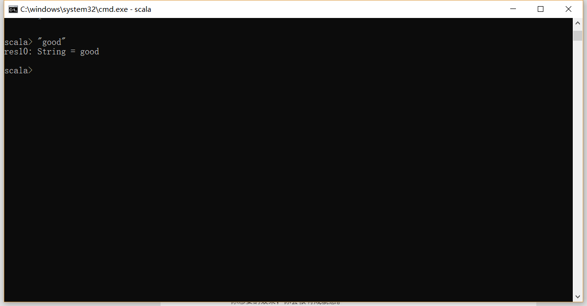
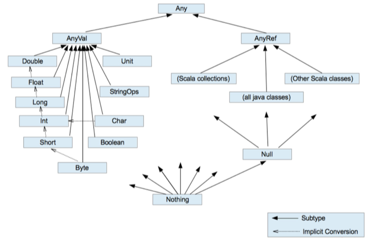

# Scala

[API地址：](www.scala-lang.org/api)

Scala是一门以虚拟机为运行环境并面向对象和函数式编程的最佳特性结合在一起的静态类型编程语言。

* 支持面向对象和函数式编程
* Scala代码会被编译成`.class`文件在虚拟机上运行

实际发生的是：你输入的内容被快速的编译成字节码，然后这段字节码交给Java虚拟机去执行。

在Scala中，

~~~scala
// 你可以对数字执行方法操作：
scala> 1.toString
res11: String = 1

// 在scala中，使用java.lang.String来表示字符串，但可以通过StringOps类给字符串添加上百种操作
// String对象，"hello"被隐式转化为一个StingOps对象，接着StringOps的 intersect方法被调用
scala> "hello".intersect("world")  // 找出相同的部分
res12: String = lo

/*
Int  		RichInt
Double      RichDouble
Char		RichDouble
在对应的Rich**方法中，提供了更加丰富的方法，来进行数字的操作
*/

// 这里的1被转为RichInt对象，然后调用其to方法
scala> 1.to(6)
res14: scala.collection.immutable.Range.Inclusive = Range(1, 2, 3, 4, 5, 6)
~~~

### 算术和操作符号的重载

在Scala中，

~~~scala
// 在Scala中，a+b 其实是方法的调用，a.+(b)这里的
scala> 1+2
res18: Int = 3

scala> 1.+(2)
res17: Int = 3

/* 通常，你可以使用  
a 方法 b
来替代
a.方法（参数）
*/
~~~

### Scala中的方法和函数

函数：在Scala中，你不需要调用某个特定类的静态方法来实现类似与求平方等操作。只是需要一个导包的操作：

~~~Scala
scala> import scala.math._  // 以 scala为前缀的包，可以省略scala.
import scala.math._

scala> pow(2,2)
res20: Double = 4.0
~~~

通常在Scala中，每一个类都会有一个伴生对象，其方法和Java的静态方法一样。例如，BigInt类有一个生成随机素数的方法，调用的形式和java几乎是一样的：

~~~scala 
scala> BigInt.probablePrime(100,scala.util.Random)
res23: scala.math.BigInt = 940640853769843387998341502449
~~~

### apply方法

在Scala中使用**apply**方法构建对象的手法是`scala`创建对象的常用手法

~~~scala
scala> "Hello"(4)
res25: Char = o

// 上述的写法实际上是下面写法的简写
scala> "Hello".apply(4)
res26: Char = o

// 将数字转为BigInt对象的apply方法，
scala> BigInt("12334")
res27: scala.math.BigInt = 12334

// 上面语句是下面语句的简写，这个语句构建了一个新的BigInt对象，而不使用new
scala> BigInt.apply("12334")
res28: scala.math.BigInt = 12334
~~~

### 表达式

***Scala语言中的表达式是有值，有类型的。***

~~~scala
if(x >0) 1 else -1

// 上述的表达式是有值的，要么为1，要么为-1，
val s = if(x > 0) 1 else - 1  // 此时的s可以为val

// 也就等价于
if(x > 0) s = 1 else s = -1  // 此时的s必须是var
~~~

上述的表达式是有类型的，上面的表达式的类型是`Int`，因为两个分支都是`Int`类型，如果两个分支的类型不一样，那么就是两个类型的超类型。例如：

~~~scala
if (x > 0) "positive" else -1 // 此时该表达式的类型就是两个类型的公共超类型：Any

// 如果是下面的这个语句，没有else的情况的时候，这个表达式的值是Unit类型，该类型只有一个值（）
if (x>0) 1  // 这个语句等同于
if(x>0) 1 else ()  
~~~

在REPL中键入多行代码：

~~~scala
scala> :paste
// Entering paste mode (ctrl-D to finish)

val x = 2
if (x > 0 ) "positive" else -1

// Exiting paste mode, now interpreting.  使用  ctrl + D来结束输入

x: Int = 2
res40: Any = positive
~~~

**语句块{} 的值取决于语句块中最后一个表达式的值**，

#### 循环

**to ** 和 **until**  的区别在于，前者包含最后一个元素，而后者不包含

~~~scala
for(i <- 表达式)  // 让变量i去遍历表达式所有的值，举个例子

for(i <- 1 to n) // i 遍历 [1,n] 之间所有的值

// 直接遍历字符串所有的值
scala> for(i<-"Hello") print(i+"\t")
H       e       l       l       o
~~~

## Scala开发环境的搭建

和安装JDK的步骤几乎一致，这里不做介绍。在Windows环境和Linux环境下均可。

## Scala的hello-world

基于在IDEA的环境下开发，第一次使用开发工具开发`Scala`的项目的时候，注意要引入Scala框架

## Scala的数据类型等

* `val` 表示的是常量的定义，常量确定值之后是不能被修改的

* `var` 表示的变量的定义，声明变量的时候必须进行初始化，不能先声明在初始化，声明变量的时候可以不进行初始化，Scala会进行类型推断

* 每个语句的后面不需要添加分号；

* Scala中的数据类型主要有两类，值类型`AnyVal`和引用类型`AnyRef`

注释和java一样，单行注释，多行注释，文档注释

Scala中的运算符都是以方法的形式存在的。

## 小tip

## 伴生对象

* 使用 **Object** 来声明，伴生对象中声明的都是"静态内容" 可以用伴生对象名称直接调用。
* 和伴生对象对应的是伴生类，伴生类的所有的静态信息都可以放置在伴生对象中。

## 样例类和模式匹配

- 样例类是为了模式匹配而生
- 在样例类对应的伴生对象中提供了`apply`方法，可以让你不需要new就可以创建对象。
- 提供了`unapply`方法可以让模式匹配可以工作

## Spark源码中常用Scala语法

~~~scala
// ClassTag 表示可推断类型  
map[U: ClassTag]

//表示类型是可以变化的。
(f: T => U) 

def parallelize[T: ClassTag](
    seq: Seq[T],
    numSlices: Int = defaultParallelism): RDD[T] = withScope {
  assertNotStopped()
  new ParallelCollectionRDD[T](this, seq, numSlices, Map[Int, Seq[String]]())
}

// 这就是Scala的函数，一个函数其中有两个参数，函数的返回类型是RDD[T] 函数体就是 withScopt{}
defaultParallelism 是默认并行度，这是一个方法。

~~~

### 调用函数时使用{}来传递参数

