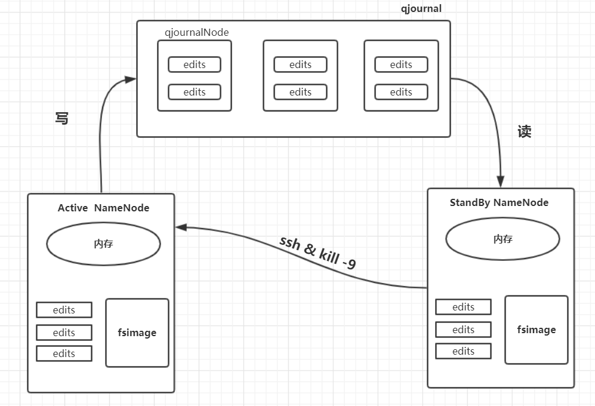
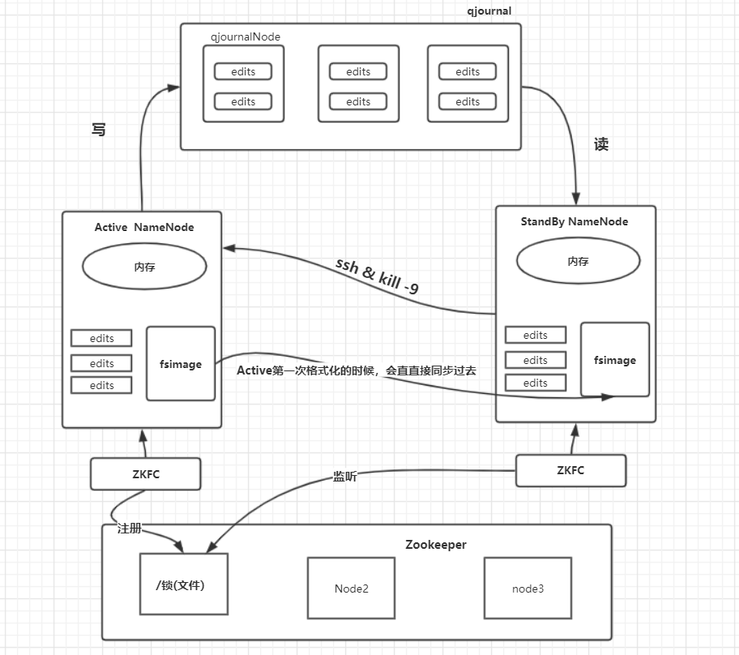

# Zookeeper

## Zookeeper常用的shell命令

[群起zookeeper的脚本地址](<https://blog.csdn.net/qq_31807385/article/details/84975964>)

~~~shell
# 启动zookeeper服务器：
[root@M1 /home/pyd/zookeeper-3.4.10]# ./bin/zkServer.sh 

# 查看状态：

# 启动zookeeper的客户端
[root@M1 /home/pyd/zookeeper-3.4.10]# ./bin/zkCli.sh

~~~

## 分布式系统一致性

### NameNode的高可用实现

#### 问题1：数据同步

如果HDFS要实现高可用的话，需要两 个namenode一个active，一个standby ，standby需要有active中的元数据，否则在active宕机的时候无法完成替换的效果。 所以两台namenode面临的第一个问题就是数据的一致性问题 即元数据的同步，active定时给standby拷数据，假设active宕机，standby中的数据是不全的。 

#### 解决方案：

弄一个第三方，这个第三方记录active 的edits文件，active的fsimage文件不能写入这个第三方，因为这会导致大量的io，但是standby需要active的fsimage文件，解决的办法是，namenode在第一次格式化之后，同步到standby。 active向第三方进行写操作，standby对这个第三方读 如此一来，我们实现了数据的同步，所以，standby和active的唯一区别是edit_process文件的有无。

#### 问题2：数据一致（脑裂）

**HDFS的NameNode的脑裂**：HDFS所有的元数据信息都存储在NameNod上，为了保证整个集群的高可用，一般会部署两个NameNode，一个NameNode做为Active，另外一个NameNode作为Standby，如果应用（Clint）或者是DataNode对于主服务器是否可用的判断不同，那么就会导致HDFS集群的混乱，例如两个应用要对HDFS进行写操作，一个认为是A可用，就将所有的信息写到的A-NameNode，另外一个认为A不可用，B可用于是将数据写到了B-NameNode，于是两个应用拿到了同样的文件路径，并且获得了写权限，于是同一个路径指向了两个不同的文件，类似这样的问题，在分布式系统中称之为**脑裂**。

#### 解决方案

为了保证数据的一致性，防止脑裂的产生，可以按照下面的方式来避免脑裂的出现，如果一个上位，直接把原来的active干掉：

基于以上的架构，我们能够实现NameNode的手动故障转移 ，如何实现故障之后的自动切换？此时，我们需要一个裁判来判断，哪个服务器是主服务器，同时这个裁判也必须要高可用，所以这个裁判应该是多个服务器构成的”裁判团“，那么问题又来了，裁判怎么防止脑裂呢？此时需要一个**多台服务器状态一致**的解决方案，比较常用的就是**Zookeeper**。

这里的zkfc是zookeeper集群的客户端

*  获取namenode的状态，
* namenode的状态；

active负责在zookeeper中注册锁，这个锁其实就是一个文件夹，然后另外一个zkfc （standby的）来监听这把锁，一旦active 发生了变化，会通过删除锁的方法来告知standby，standby 就能够监听到这个变化，会将standby变为active。

## zookeeper架构：

zookeeper可以说是一个提供锁服务的分布式系统，它由多台服务器构成一个集群对外提供锁服务，应用程序连接到任意一台服务器都可以获取或者是释放锁，因此这些服务器必须保持严格的状态一致，不能出现一台服务器将锁交给一台服务器，另外一台服务器将锁交给另外一台服务器。如何保证一把锁只是交给一个应用？Paxos就是用来解决这个问题的。如下：

应用服务器连接到任意一台服务器后提起状态修改申请，从图中看也就是服务器1，会将这个请求发给集群中的其他服务器进行表决，表决结果会发送给其他所有服务器，如果某个服务器同时收到了另一个应用程序同样的修改请求，它可能会拒绝服务器 1 的表决，并且自己也发起一个同样的表决请求，那么其他服务器就会根据时间戳和服务器排序规则进行表决。

表决结果会发送给其他所有服务器，最终发起表决的服务器也就是服务器 1，会根据收到的表决结果决定该修改请求是否可以执行，从而在收到请求的时候就保证了数据的一致性。zookeeper中使用paxos算法的简化版；**ZAB协议（原子消息广播协议）**来保证zookeeper中数据的一致性。

ZooKeeper 系统中所有服务器都存储相同的数据，并且每次数据的更新都需要所有的服务器表决，所以和一般的分布式系统相反，性能会随着数量的增加而下降。

zookeeper通过树状结构的方式来记录数据：

大数据集群通常都是主从架构，主服务来管理集群的状态和元数据的信息，为了防止脑裂，在运行期间只能有一个服务工作，同时为了高正高可用，必须有另外一台服务器保持热备，那么应用服务和集群中的其他服务器如何才能知道当前的那个服务器是工作的主服务器呢？所以很多的大数据系统都依赖Zookeeper来提供一致性数据服务，用于选举主服务器。一台主服务器启动之后向zookeeper注册自己为主服务器，后来向zookeeper注册的就只能是热备服务器，应用程序运行期间和主服务器通信。

如果当前的主服务器宕机（zookeeper上注册的心跳数据不在更新）热备服务器通过zookeeper的监控机制发现当前工作的主服务器宕机，就想zookeeper注册自己为当前工作的主服务器，应用和集群中的其他服务器会和新的主服务器进行通信。